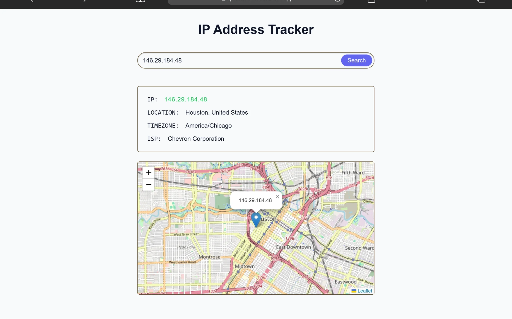

# 🌐 IP Address Tracker

A responsive IP address tracking application that retrieves IP information and displays the location on an interactive map.

<div align="center">

[](YOUR_LIVE_DEMO_URL)

</div>

## 🌐 Live Demo

[](YOUR_LIVE_DEMO_URL)

## 📂 GitHub Repository

## [](YOUR_GITHUB_REPOSITORY_URL)

## 📖 About

The IP Address Tracker is a responsive web application that allows users to search for an IP address and view useful information about it.

The application was built to practice:

* Working with multiple APIs
* Fetching and handling asynchronous data
* Working with nested API response objects
* DOM manipulation
* Form handling and user input
* Interactive maps with Leaflet
* Updating UI content dynamically
* Handling API and network errors

The application also automatically detects the user's public IP address when the page loads.

---

## ✨ Features

* Automatically detects the user's public IP
* Search for any valid IP address
* Display IP address information
* Display geographical location
* Display country and city
* Display timezone
* Display ISP information
* Interactive map
* Map marker for the IP location
* Map updates when a new IP is searched
* Responsive design
* API error handling
* User input validation
* Mobile-friendly interface

---

## 🛠️ Built With

* HTML5
* CSS3
* JavaScript (ES6+)
* Fetch API
* IPify API
* HackMyIP API
* Leaflet.js
* OpenStreetMap

### APIs

**IPify**

Used to retrieve the user's public IP address when the application initially loads.

**HackMyIP**

Used to retrieve detailed information about an IP address, including:

* IP address
* City
* Country
* Timezone
* ISP
* Latitude
* Longitude

**Leaflet**

Used to create the interactive map and display the IP location.

**OpenStreetMap**

Used as the map tile provider for Leaflet.

---

## 📁 Folder Structure

```text
ip-address-tracker/
│
├── assets/
│   ├── images/
│   ├── screenshots/
│   └── preview.webp
│
├── css/
│   └── style.css
│
├── js/
│   └── script.js
│
├── index.html
└── README.md
```

---

## 🚀 Getting Started

Clone the repository:

```bash
git clone https://github.com/krowey-richmond/ip-tracker.git
```

Navigate into the project:

```bash
cd ip-tracker
```

Open `index.html` in your browser or use the Live Server extension in VS Code.

---

## 🔄 How It Works

When the application loads:

```text
User opens the application
        ↓
IPify retrieves the user's public IP
        ↓
HackMyIP retrieves detailed IP information
        ↓
Information is rendered to the page
        ↓
Latitude + Longitude are passed to Leaflet
        ↓
Map displays the IP location
```

When the user searches for an IP:

```text
User enters an IP address
        ↓
Form submission
        ↓
HackMyIP retrieves IP information
        ↓
Information is rendered
        ↓
Leaflet updates the map
        ↓
Marker moves to the new location
```

---

## 📸 Screenshots

Check the [screenshots folder](YOUR_SCREENSHOTS_FOLDER_URL) for screenshots of the application.

---

## 🎯 Future Improvements

* Improve loading states
* Add a dedicated error message UI
* Add a loading spinner
* Improve map marker popup
* Add IP address validation
* Add search history
* Add recent searches
* Improve accessibility
* Add dark mode
* Add more detailed IP/network information

---

## 🤝 Contributing

Contributions, suggestions, and feedback are welcome.

1. Fork the repository
2. Create a feature branch
3. Commit your changes
4. Push to your branch
5. Open a Pull Request

---

## 📬 Contact

### [](https://github.com/krowey-richmond)

### [](https://linkedin.com/in/krowey-richmond)

### [](mailto:kroweyrichmond2004@email.com)

---

## 📄 License

This project is licensed under the MIT License.

---

## ⭐ Support

If you found this project useful, consider giving it a ⭐ on GitHub.
